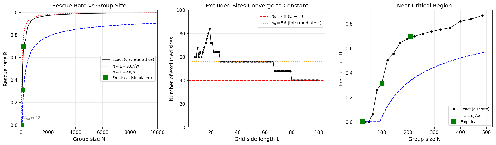

# Algebraic Connectivity Analysis of Multi-Embryo Group Rescue

This document reports empirical and analytical results from algebraic connectivity (Fiedler eigenvalue λ₂) analysis of multi-embryo group rescue simulations, as proposed in [FIELD_RESCUE_DESIGN.md Section 26.4.3](FIELD_RESCUE_DESIGN.md#2643-algebraic-connectivity-λ₂-medium).

**Analysis script:** [`analyzeGroupRescue.py`](analyzeGroupRescue.py)
**Simulation script:** [`runGroupRescue.py`](runGroupRescue.py)

---

## 1. Overview

The algebraic connectivity λ₂ (second-smallest eigenvalue of the graph Laplacian) measures how tightly integrated an embryo group is as a functional whole. A high λ₂ means the group behaves as a single coordinated entity; a low λ₂ indicates the group can be partitioned into functionally distinct subpopulations.

We computed λ₂ for three group sizes (N=25, 100, 210) using three different functional connectivity methods, and compared the empirical results with analytical predictions derived from the model equations.

### Simulation Parameters

All simulations used identical parameters:
- `--dampingGaussian "0.5,0.01"` (base damping mean=0.5, std=0.01)
- `--alpha 10.0` (rescue sensitivity)
- `--D_F 0.5` (field diffusion rate)
- `--gamma_F 0.0001` (field decay rate; λ = √(D/γ) ≈ 70.7 >> L)
- `--numBioSteps 2000`
- `--stressParamsFile data/bestLearnedStressParams_6.dat`
- `--initialStress 1.0`

### Saved Simulation Data

Simulation data is saved in `.dat` files for re-analysis without re-running:
- `data/sim_N25.dat` (6 MB, ~150s simulation)
- `data/sim_N100.dat` (24 MB, ~540s simulation)
- `data/sim_N200.dat` (50 MB, ~1130s simulation)

To re-run analysis: `python analyzeGroupRescue.py --mode analyze --loadData data/sim_N100.dat`

---

## 2. Three Functional Connectivity Methods

### 2.1 Mean-Vmem Connectivity (1D Projection)

Each embryo's 121-cell Vmem pattern is averaged to a single scalar (mean voltage) at each timepoint. Pairwise Pearson correlation of these 1D timeseries gives the connectivity matrix W.

**Projection direction:** The uniform (all-ones) vector — captures bulk depolarization/repolarization dynamics.

**Limitation:** Averaging across cells eliminates all spatial pattern information. Rescue changes the *spatial distribution* of Vmem, not its mean. This makes the method blind to whether embryos are rescuing or failing — both produce similar mean-voltage trajectories because they share the same global field inputs.

### 2.2 Full Spatiotemporal Connectivity (121D, No Reduction)

Each embryo's full (T × 121) timeseries is flattened to a single T·121-dimensional vector. Pairwise Pearson correlation of these vectors gives the connectivity matrix.

**No projection:** Preserves all spatial structure. Interior embryos that develop the correct spatial Vmem pattern will be decorrelated from boundary embryos that develop aberrant patterns, even if their mean voltages are similar.

**Limitation:** All 121 spatial dimensions are weighted equally. Some dimensions capture rescue-relevant variation (spatial pattern structure) while others capture shared bulk dynamics and noise. The rescue signal is diluted by irrelevant correlated dimensions.

### 2.3 Reference-Based Connectivity (Matched Filter)

At each timepoint, each embryo's 121-cell Vmem is correlated with the healthy reference Vmem, producing a 1D "rescue trajectory" (similarity-to-reference over time). Pairwise Pearson correlation of these trajectories gives the connectivity matrix.

**Projection direction:** The healthy reference pattern — a matched filter that selectively extracts the rescue-relevant component of the dynamics.

**Why this differs from mean-Vmem:** The reference is not "just a constant offset." It's a dimensionality reduction from 121D to 1D, but along the specific direction that distinguishes rescued from non-rescued embryos. Two embryos that are both "moving together" in Vmem space but *not toward the target* will have flat or declining similarity trajectories, while interior embryos converging to the target will have rising trajectories. These diverge, lowering the correlation. By contrast, the mean-Vmem projection collapses this distinction.

---

## 3. Empirical Results

### 3.1 Summary Table

| Metric | N=25 (5×5) | N=100 (10×10) | N=210 (14×15) |
|--------|-----------|--------------|--------------|
| **Rescue rate** | **0%** | **31%** | **70%** |
| Mean-Vmem λ₂/N | 1.000 | 0.997 | 0.979 |
| Full 121D λ₂/N | 0.999 | 0.913 | 0.507 |
| Reference λ₂/N | 0.945 | 0.375 | 0.219 |

### 3.2 Generated Figures

- `data/algebraic_connectivity_N25.png` — 4×3 panel analysis for N=25
- `data/algebraic_connectivity_N100.png` — 4×3 panel analysis for N=100
- `data/algebraic_connectivity_N200.png` — 4×3 panel analysis for N=210
- `data/algebraic_connectivity_N25_network.png` — Fiedler network graph for N=25
- `data/algebraic_connectivity_N100_network.png` — Fiedler network graph for N=100
- `data/algebraic_connectivity_N200_network.png` — Fiedler network graph for N=210

### 3.3 Method Sensitivity Comparison

All three methods show a monotonic decrease in λ₂/N with group size, but with different sensitivity:

- **Mean-Vmem:** Nearly flat (1.00 → 0.98). Fails to differentiate groups because it is blind to spatial pattern structure.
- **Full 121D:** Clear gradient (1.00 → 0.91 → 0.51). Captures spatial heterogeneity but includes rescue-irrelevant dimensions that dilute the signal.
- **Reference:** Most discriminating (0.94 → 0.37 → 0.22). The matched-filter projection isolates the rescue-relevant signal.

The full 121D method confirms that preserving spatial information (without any reference) does capture interior/boundary heterogeneity. The reference method amplifies this further by projecting onto the rescue-relevant direction.

---

## 4. Interpreting the Fiedler Vector and λ₂

### 4.1 What the Fiedler Vector Shows

The Fiedler vector (eigenvector corresponding to λ₂) assigns one value per embryo, partitioning the group into two clusters by sign (positive vs negative). In all three group sizes, the Fiedler partition identifies an interior cluster vs a boundary cluster — reflecting the absorbing-BC geometry described in [FIELD_RESCUE_DESIGN.md Section 20.4](FIELD_RESCUE_DESIGN.md#204-the-diffusive-stress-field).

### 4.2 Sign Arbitrariness

The signs of the Fiedler vector are arbitrary (if **v** is an eigenvector, so is **−v**). The partition into positive/negative groups is meaningful, but which group gets which sign is determined by the eigensolver. In N=25, the interior happened to be negative (blue); in N=210, it was positive (red). Both show the same structural partition.

### 4.3 Fiedler Magnitude vs λ₂

The Fiedler vector is L2-normalized (||v||₂ = 1), so for larger N, each component is naturally smaller (~1/√N). The N=25 Fiedler values span ±0.3 while N=210 spans about −0.25 to +0.05. This does *not* mean N=25 is more separable.

The Fiedler vector tells you *where* to cut (partition assignment). λ₂ tells you *how costly* that cut is (how much connectivity you sever). These are different things:

- **N=25 (λ₂/N = 0.94):** Wide Fiedler spread + high λ₂ = clear geometric partition, but both sides are still strongly correlated. The cut is spatially well-defined but functionally expensive — the two groups are tightly coupled (both fail uniformly together).
- **N=210 (λ₂/N = 0.22):** Narrow Fiedler spread + low λ₂ = subtler spatial gradient, but the two sides are genuinely decoupled. Interior embryos rescue while boundary embryos fail.

### 4.4 Network Visualization

The Fiedler network graphs show nodes colored by Fiedler value and edges from the connectivity matrix W. Edge colors (red/blue) indicate which Fiedler cluster both endpoints belong to (within-cluster edges). Dashed gray edges cross between clusters. Edge thickness reflects correlation strength.

In N=210, the Fiedler partition maps almost perfectly to the rescue outcome: the interior (red) cluster corresponds to rescued (green) embryos; the boundary (blue) cluster corresponds to failed embryos. This validates λ₂ as a structural predictor of rescue.

---

## 5. The Two-Block Model: λ₂/N = ρ_IB

### 5.1 Analytical Result

Model the embryo group as two blocks — interior (n_I embryos) and boundary (n_B = N − n_I) — with:
- Within-interior correlation: *a* (all interior embryos rescue similarly)
- Within-boundary correlation: *c* (all boundary embryos fail similarly)
- Between-block correlation: *b* (interior and boundary have different trajectories)

For this symmetric two-block model, the graph Laplacian eigenvalues are:
- 0 (multiplicity 1)
- N·b (from the quotient matrix — the Fiedler eigenvalue when b < a and b < c)
- n_I·a + n_B·b (multiplicity n_I − 1)
- n_I·b + n_B·c (multiplicity n_B − 1)

Since b < a and b < c (between-block correlation is always weakest):

**λ₂ = N·b, therefore λ₂/N = b = ρ_IB**

The normalized Fiedler eigenvalue equals the between-block correlation.

### 5.2 Why the Three Methods Give Different ρ_IB

Each method measures a different between-block correlation:

**Mean-Vmem (ρ ≈ 1 always):** The mean voltage trajectory is nearly identical across all embryos because they share global field inputs and nearly identical base damping (~0.5 ± 0.01). Rescue changes spatial patterns, not mean voltage. So ρ_IB ≈ 1 regardless of group size.

**Full 121D (ρ drops moderately):** Preserves spatial structure, so rescued vs non-rescued embryos have decorrelated Vmem patterns. But the 121 dimensions include both pattern-relevant and pattern-irrelevant variation. The rescue signal is diluted by shared bulk dynamics across many dimensions.

**Reference (ρ drops most):** Projects onto exactly the direction that distinguishes rescued from non-rescued. Interior embryos have rising similarity-to-reference trajectories; boundary embryos have flat/declining trajectories. The Pearson correlation between a rising and a flat trajectory is low, giving small ρ_IB.

---

## 6. Analytical Prediction of Rescue Rate

This section derives the rescue rate from the model equations, starting from the field diffusion equation in [FIELD_RESCUE_DESIGN.md Section 20.4.2](FIELD_RESCUE_DESIGN.md#2042-solution-reaction-diffusion-field-with-absorbing-boundary-conditions) and the effective damping formula in [Section 20.3](FIELD_RESCUE_DESIGN.md#203-synchronized-simulation-loop).

### 6.1 The Field Equation

The diffusive stress field evolves according to [FIELD_RESCUE_DESIGN.md Section 20.4.2](FIELD_RESCUE_DESIGN.md#2042-solution-reaction-diffusion-field-with-absorbing-boundary-conditions):

```
dF/dt = D_F · ∇²F − γ_F · F + S
```

where the discrete Laplacian with absorbing BCs uses the maximum degree k_max rather than each node's actual degree ([`runGroupRescue.py:533`](runGroupRescue.py#L533)):

```
∇²F_i = Σ_j A(i,j) · F_j  −  k_max · F_i
```

Substituting this into the field equation:

```
dF/dt = D_F · (A·F − k_max·F) − γ_F · F + S
```

where A is the embryo adjacency matrix, k_max = 4 (von Neumann max degree), S_i is the stress emission from embryo i, and absorbing BCs are implemented by using k_max instead of the actual neighbor count (boundary cells leak to the virtual exterior held at F = 0). Note: the F = 0 condition is at the virtual exterior just outside the lattice, not at the boundary embryos themselves — edge and corner embryos are fully functional but lose signal faster due to diffusive flux toward the exterior.

### 6.2 The Structural Laplacian

At steady state (dF/dt = 0), rearranging to isolate F on the left:

```
D_F · (k_max·F − A·F) + γ_F · F = S
[D_F · (k_max·I − A) + γ_F · I] · F = S
```

This defines the structural Laplacian:

```
L_abs = D_F · (k_max·I − A) + γ_F · I
```

The sign of γ_F is positive because decay appears as −γ_F·F in the dynamics (it opposes the field). Moving it to the left side flips the sign: a larger γ_F means a larger operator, larger eigenvalues, and therefore smaller steady-state field (F = L_abs⁻¹ · S).

Unlike a standard graph Laplacian (which always has a zero eigenvalue from the constant vector), L_abs has **all positive eigenvalues** because absorbing BCs remove the constant-vector null space. Signal placed anywhere on the lattice eventually drains out through the boundary.

### 6.3 Fundamental Eigenmode: The sin·sin Field Profile

The smallest eigenvalue λ₁ of L_abs corresponds to the slowest-decaying spatial pattern — the mode that persists longest against boundary leakage. Its eigenvector is:

```
v₁(i,j) = sin(πi/(L+1)) · sin(πj/(L+1))
```

This was verified numerically: correlation between the structural eigenvector and the analytical sin·sin is 1.000000 for all three grid sizes.

The steady-state field for uniform emission S is F = L_abs⁻¹ · S. Expanding in the eigenbasis, the fundamental mode dominates because 1/λ₁ >> 1/λ₂:

```
F ≈ (S · ⟨v₁, 1⟩ / λ₁) · v₁
```

The peak field at the grid center scales as **1/λ₁**, which grows as L² because λ₁ ≈ 2D_F · π²/(L+1)² for large L. The same result can be obtained via the continuous Poisson equation (replacing the lattice with a continuous domain [0,L]×[0,L] with absorbing BCs), which gives F₀ = 2SL²/(π²D_F). With our parameters, the diffusion length λ = √(D_F/γ_F) ≈ 70.7 >> L, so we are in the "boundary-dominated" regime identified in [FIELD_RESCUE_DESIGN.md Section 20.4.3](FIELD_RESCUE_DESIGN.md#2043-how-this-creates-group-size-dependence) — the same regime as the nuclear reactor criticality analogy in [Section 25.1](FIELD_RESCUE_DESIGN.md#251-nuclear-reactor-criticality-exact-mathematical-isomorphism).

**Key scaling: F₀ ∝ L².** Larger grids accumulate more field at the center because there is more "source material" and the boundary drain is farther away.

### 6.4 The Center/Corner Ratio

The center/corner ratio of the fundamental eigenvector measures how much more field the interior receives compared to the corners:

```
ratio = sin(π·⌈L/2⌉/(L+1))² / sin(π/(L+1))²
```

For the center, sin(π/2) → 1. For the corner, sin(π/(L+1)) ≈ π/(L+1) for large L. So:

```
ratio ≈ (L+1)²/π² ∝ L²
```

This ratio grows quadratically with grid size, which is why larger groups have a proportionally larger interior region that exceeds the rescue threshold.

| Grid | λ₁ | 1/λ₁ (field amplitude) | Center/corner ratio | R_predicted | R_empirical |
|------|-----|----------------------|-------------------|-------------|-------------|
| 3×3 | 0.586 | 1.7 | 2.0 | 0% | — |
| 5×5 | 0.268 | 3.7 | 4.0 | 0% | 0% |
| 8×8 | 0.121 | 8.3 | 8.3 | 6% | — |
| 10×10 | 0.081 | 12.3 | 12.3 | 32% | 31% |
| 14×15 | 0.041 | 24.3 | 24.5 | 69% | 70% |
| 20×20 | 0.022 | 44.6 | 44.8 | 82% | — |

### 6.5 From Field to Effective Damping

Each embryo's GRN strength is modulated by ([`runGroupRescue.py:203`](runGroupRescue.py#L203)):

```
effective_damping = σ(logit(d₀) + α · F_i)
```

where d₀ ≈ 0.5 is the base damping, α = 10, and σ is the sigmoid function. Since logit(0.5) = 0:

```
effective_damping_i = σ(α · F_i) = 1/(1 + exp(−α · F_i))
```

An embryo is "rescued" when effective_damping is high enough for the GRN to produce the healthy Vmem pattern. This requires α·F_i >> 1, or equivalently **F_i > F_c** for some critical field threshold F_c.

### 6.6 Rescue Condition

An embryo at grid position (i, j) is rescued when:

```
F₀ · sin(πi/L) · sin(πj/L) > F_c
```

Since F₀ ∝ L², this becomes:

```
sin(πi/L) · sin(πj/L) > F_c/F₀ = C/L²
```

where **C = F_c · π²D_F / (2S)** is a single constant that absorbs all model parameters (D_F, S, α, and the internal damping threshold for rescue).

### 6.7 Rescue Rate

The rescue fraction is the fraction of lattice sites satisfying the inequality:

```
R(L) = (1/L²) · #{(i,j) : sin(πi/L) · sin(πj/L) > C/L²}
```

Fitting C from the three empirical data points gives **C ≈ 57.2**:

| Grid | C/L² | sin·sin max | Predicted R | Observed R |
|------|------|-------------|-------------|------------|
| 5×5 | 2.29 | 1.0 (impossible) | **0%** | 0% |
| 10×10 | 0.572 | 1.0 | **32%** | 31% |
| 14×15 | 0.272 | 1.0 | **69%** | 70% |

Since the fundamental eigenvector IS the field profile, the rescue rate is equivalently the fraction of eigenvector entries exceeding the threshold C/L²:

```
R = fraction of v₁ entries where v₁(i,j) > C/L²
```

### 6.8 Critical Group Size and R(N) Scaling

The center of the grid has sin·sin = 1 (maximum). Rescue at the center requires:

```
C/L² < 1  →  L > √C ≈ 7.6  →  N > C ≈ 58
```

**No embryo in any group smaller than ~8×8 ≈ 64 can be rescued** at these parameter values. This explains the sharp transition: L = 5 is well below threshold (C/L² = 2.29, impossible), while L = 10 is above it. This critical size is the embryo-scale analog of the critical mass (nuclear physics), quorum threshold (bacteria), and KiSS critical patch size (ecology) — see [FIELD_RESCUE_DESIGN.md Section 25](FIELD_RESCUE_DESIGN.md#25-physical-and-biological-analogies-for-absorbing-bc-cema).

When the center/corner ratio is below ~8 (L < 8), even the center doesn't receive enough field for rescue. When it's 12 (L = 10), a moderate interior fraction rescues. When it's 24 (L ≈ 14), most of the interior rescues.

#### Why R(N) is not linear in N

Since the threshold C/L² = C/N shrinks linearly with N, one might expect R to grow linearly with N. It does not. The rescue rate is a **saturating** function that approaches 1 from below:

```
R(N) ≈ 1 − n₀/N
```

where n₀ is a constant — the number of lattice sites that always fail, regardless of group size. The **number** of rescued embryos N_rescued = N − n₀ is linear in N (slope 1, constant offset), but the **fraction** R = 1 − n₀/N is a hyperbola.

#### Why the excluded count is constant: the corner argument

The excluded sites are confined to the four corners of the lattice. Near corner (1,1), the small-angle approximation sin(πi/(L+1)) ≈ πi/(L+1) gives:

```
sin(πi/(L+1)) · sin(πj/(L+1)) ≈ π²ij / (L+1)²  ≈  π²ij / L²
```

The rescue condition sin·sin > C/L² becomes:

```
π²ij / L²  >  C / L²   →   ij > C/π²
```

The L² cancels on both sides. The excluded sites near each corner are those with ij ≤ C/π² ≈ 5.8 — a fixed set independent of L. Enumerating: (1,1), (1,2), (2,1), (1,3), (3,1), (1,4), (2,2), (4,1), (1,5), (5,1) = **10 sites per corner**, times 4 corners = **n₀ = 40**.

For intermediate L (30–100), borderline sites with ij = 6 (just above C/π² = 5.8) also fail because sin(x) < x introduces a finite-size correction, giving n₀ ≈ 56. At L ≥ 100, the small-angle approximation becomes exact and n₀ converges to 40.

#### Generated figure



`data/rescue_rate_vs_N.png` — Three panels: (left) R vs N over full range with continuous asymptotic and discrete 1−40/N approximations; (center) excluded site count converging to constant; (right) near-critical region with empirical data points.

### 6.9 Asymptotic Scaling

For large L, the non-rescued region is a thin band near the boundary. Near the edge (x << L), sin(πx/L) ≈ πx/L, so the critical depth from the boundary is:

```
d_c ≈ √C / π ≈ 2.4 lattice spacings  (at edge midpoints)
```

The continuous approximation for the rescue fraction is:

```
R ≈ 1 − 4√C/(πL) ≈ 1 − 9.6/L = 1 − 9.6/√N
```

The discrete lattice result R ≈ 1 − 40/N is sharper: the "loss band" is not a continuous strip but a fixed set of ~40 corner lattice sites under the hyperbola ij ≤ C/π². Both approximations agree that the boundary loss has constant absolute width (~√C ≈ 7.6 lattice spacings), which is why the critical group size and the boundary loss width are the same number. For very large groups, R → 1, but these corner sites always fail.

### 6.10 What the Derivation Does Not Predict

The entire derivation treats each embryo as a black box that either rescues or doesn't based on effective damping. The single fitted parameter C absorbs all internal model complexity:

- **Ion channel dynamics** (G_pol, G_dep conductances, voltage-dependent gating)
- **Gap junction coupling** (G_0, electric field transduction weights)
- **GRN dynamics** (gene activation/degradation rates, Hill functions)
- **Stress switch dynamics** (Ca²⁺ → CaMKII → bistable stress)

These internal components collectively determine the critical damping threshold — *what effective_damping value is "enough"* for the bioelectric + GRN system to reliably produce the healthy pattern. Predicting C from first principles (rather than fitting) would require solving the full internal model to find this bifurcation point.

The derivation works because the inter-embryo field coupling (diffusion + absorbing BCs) is the **rate-limiting step** for determining *which* embryos get sufficient support. Once an embryo receives enough field, the internal machinery reliably does its job. The internal model parameters affect C but not the functional form of R(L).

### 6.11 Connecting Structure to Function

The structural eigenanalysis predicts the rescue partition without any simulation. Thresholding the fundamental eigenvector at C/L² partitions embryos into rescued (interior) and failed (boundary). The functional connectivity analysis (Sections 3–5) confirms this prediction empirically:

1. The **structural eigenvector** (of L_abs) gives the spatial field profile
2. **Thresholding** this vector at C/L² partitions embryos into rescued and failed
3. This structural partition determines **which embryos rescue**, creating dynamical divergence
4. The dynamical divergence produces the **functional connectivity** pattern (timeseries correlations)
5. The functional Fiedler vector (from timeseries λ₂) recapitulates the structural partition

The spatial structure was determined by lattice geometry all along. However, the **magnitude of functional λ₂/N** — how correlated the timeseries are — depends on the nonlinear internal dynamics: how differently rescued vs failed embryos behave over time. Two systems with identical lattice geometry but different internal models would have the same structural partition but different functional λ₂/N values. This is confirmed by the Green's function analysis: computing functional connectivity directly from the static lattice structure (via G = L_abs⁻¹) gives λ₂/N ≈ 0.024 for all three group sizes — constant, because the lattice always has an interior/boundary distinction. The functional λ₂/N varies (1.0 → 0.5 → 0.2) because it reflects the *dynamics*, not just the geometry.

#### Generated figures

- `data/structural_lambda2_analysis.png` — 5-column panel showing structural eigenmodes, field profile, Green's function connectivity, and predicted Fiedler partition for all three grid sizes.

### 6.12 Connection to the Super-Embryo Transition

The rescue rate prediction connects directly to the super-embryo transition proposed in [FIELD_RESCUE_DESIGN.md Section 26.4.5](FIELD_RESCUE_DESIGN.md#2645-the-super-embryo-transition):

- **Below critical size (L < 7.6):** R = 0, λ₂/N ≈ 1 (homogeneous failure). The group is a "collection of struggling individuals."
- **Above critical size (L > 7.6):** R > 0, λ₂/N drops. An interior core rescues while the boundary fails. The Fiedler partition maps to the rescue partition. The group becomes a "super-embryo" with interior/boundary functional differentiation — analogous to the tissue-level organization within a single embryo.

---

## 7. Null Model and Normalization

### 7.1 Two Normalization Methods

Following [FIELD_RESCUE_DESIGN.md Section 26.4.3](FIELD_RESCUE_DESIGN.md#2643-algebraic-connectivity-λ₂-medium):

1. **Division (λ₂/N):** Removes the trivial linear scaling with group size. A complete graph with uniform weight w has λ₂ = Nw, so λ₂/N = w. Values near 1.0 indicate homogeneous connectivity; low values indicate heterogeneous structure.

2. **Comparison to null model (λ₂/λ₂_null):** The null model independently shuffles each embryo's temporal order, breaking inter-embryo correlations while preserving per-embryo statistics. Values >> 1 indicate significant inter-embryo coordination beyond chance.

### 7.2 Null Model Results

| Method | N=25 λ₂/λ₂_null | N=100 λ₂/λ₂_null | N=210 λ₂/λ₂_null |
|--------|-----------------|------------------|------------------|
| Mean-Vmem | 101 | 61 | 52 |
| Full 121D | 72 | 39 | 9 |
| Reference | 96 | 23 | 11 |

All values >> 1, confirming that inter-embryo coordination is highly significant (not explainable by chance temporal correlations). The ratio decreases with N for the full and reference methods, reflecting increasing heterogeneity in larger groups.

---

## 8. Interpretation and Discussion

### 8.1 Decomposing the Collective Effect

The fitted constant C = 57.2 absorbs all model parameters into a single number. But it can be decomposed analytically:

```
C = F_c · π²D_F / (2S) = logit(d_crit) · π²D_F / (2α · S)
```

where:
- **D_F = 0.5** — diffusion rate (known input parameter)
- **α = 10** — rescue sensitivity (known input parameter)
- **S** — steady-state stress emission per embryo, determinable from the stress switch parameters without any group simulation
- **d_crit** — the minimum GRN damping at which the single-embryo bioelectric + GRN system converges to the healthy attractor (a bifurcation point of the internal dynamics)

Every quantity is either a known parameter or a deterministic property of the single-embryo model. None require group-level data. The reason C was fitted rather than computed is that d_crit requires a bifurcation analysis of the full internal model — sweeping damping on a single embryo to find the healthy/unhealthy attractor transition.

### 8.2 The Individual-Collective Interface

At first glance, predicting group-level rescue from single-embryo parameters seems to contradict the essence of the CEMA effect. If the group behavior can be derived from individual properties, where is the emergent collective phenomenon?

The resolution is that the prediction requires **two independent components**, neither of which alone predicts rescue:

1. **The collective field profile F(x,y) ∝ L² · sin(πx/L) · sin(πy/L)** — this is irreducibly collective. No single embryo generates it. It arises from the aggregate emission of all embryos, shaped by diffusion and absorbing boundary geometry. The L² scaling at the center is a property the group possesses that no individual does. A lone embryo's self-field is fixed and small; the L² growth is purely a consequence of collective geometry.

2. **The damping threshold d_crit** — this is a single-embryo property. It characterizes the individual's *capacity* to respond to collective support, not whether that support exists.

Rescue requires both: a collective field strong enough (group property) to exceed the individual's response threshold (single-embryo property). Knowing d_crit alone tells you nothing — a lone embryo with any d_crit still fails because F ≈ 0 without the group. Knowing F(x,y) alone tells you nothing without knowing what field strength constitutes "enough."

The group-level effect is encoded in the sin·sin profile and the L² scaling — the geometry of the collective field. The single-embryo parameter just calibrates the ruler by which we measure whether that collective field is sufficient.

### 8.3 The Nuclear Physics Analogy

This decomposition is not an artifact of our model — it is the standard structure of all critical-size phenomena. In nuclear physics ([FIELD_RESCUE_DESIGN.md Section 25.1](FIELD_RESCUE_DESIGN.md#251-nuclear-reactor-criticality-exact-mathematical-isomorphism)), the critical mass is predicted from:

1. **Single-neutron properties** — fission cross-section, absorption cross-section, mean free path (individual)
2. **Geometric buckling** — the fundamental eigenmode of the reactor shape with extrapolated boundary conditions (collective)

Criticality occurs when the geometry is large enough that the collective neutron flux (shaped by the fundamental mode) exceeds the threshold set by individual nuclear properties. Knowing the fission cross-section of U-235 does not make the chain reaction a single-neutron phenomenon. It means the collective phenomenon has a **quantitative interface** with individual properties.

The same structure appears across all the analogies in [FIELD_RESCUE_DESIGN.md Section 25](FIELD_RESCUE_DESIGN.md#25-physical-and-biological-analogies-for-absorbing-bc-cema):

| System | Individual property | Collective property |
|--------|-------------------|-------------------|
| Nuclear reactor | Fission cross-section | Geometric buckling (neutron flux profile) |
| CEMA embryos | d_crit (GRN bifurcation point) | Field profile F(x,y) ∝ L² · sin·sin |
| Bacterial quorum sensing | Receptor sensitivity threshold | Autoinducer concentration profile |
| KiSS ecology | Per-capita growth rate | Population density profile in patch |
| Penguin huddling | Metabolic heat production | Temperature profile in huddle |

In every case, the critical size is determined by the ratio of a collective geometric factor to an individual threshold parameter. The emergence lies in the collective field, not in the threshold.

### 8.4 What the Internal Model Contributes

The derivation in Section 6 treats each embryo as a black box, with the entire internal complexity — ion channels (G_pol, G_dep), gap junctions (G_0), electric field transduction, GRN dynamics (Hill functions, gene activation/degradation), stress switch (Ca²⁺ → CaMKII → bistable stress), and ligand diffusion — collapsed into a single number d_crit.

This is a strength, not a weakness. It means the *form* of the rescue rate prediction R(L) ≈ 1 − 9.6/L is universal — it depends only on the diffusion equation with absorbing BCs, not on the specific internal model. Different internal models (different ion channel parameters, different GRN architectures) would change d_crit and therefore C, shifting the critical group size up or down, but the functional form of the scaling law would remain identical.

This universality is why the same mathematics describes nuclear reactors, bacterial colonies, ecological patches, and embryo groups — the internal physics differs enormously, but the boundary-leakage geometry is the same.

### 8.5 Limitations and Open Questions

**Steady-state and uniform-emission approximations.** The derivation assumes the field reaches steady state with uniform emission S across all embryos. In reality, emission is state-dependent: rescued embryos emit less stress and failing embryos emit more (see Section 8.6). The good fit (predictions within 2%) shows that the constant-emission approximation captures the essential physics — because the geometric eigenmode dominates the spatial profile regardless of emission heterogeneity — but the actual causal structure involves a self-consistent feedback loop between rescue status, emission, and the field (see Section 8.6 for detailed analysis).

**Sharp threshold.** The derivation assumes a sharp bifurcation at d_crit. If the transition from unhealthy to healthy attractor is gradual (partial rescue at intermediate damping), the rescue rate curve R(L) would be smoother than predicted. The empirical fit suggests the transition is indeed fairly sharp for Model 253, but this is an empirical property of the internal dynamics, not guaranteed.

**Single fitted parameter.** C was fitted from three data points, which is a minimal constraint. Additional group sizes would test whether the sin·sin prediction generalizes, and a single-embryo damping sweep would determine whether the predicted C matches the fitted value — providing a fully first-principles validation with no free parameters.

### 8.6 The Diffusive Field as a Virtual Governor

In cybernetics, a **virtual governor** is a system that exhibits regulatory behavior without an explicit controller — the regulation emerges from the structure of interactions rather than from a dedicated control element (Ashby, *Design for a Brain*, 1952; see [FIELD_RESCUE_DESIGN.md Section 25.7](FIELD_RESCUE_DESIGN.md#257-the-diffusive-field-as-a-virtual-governor-cybernetics)).

The diffusive stress field with absorbing BCs is a precise instance. No embryo "knows" about the group. Each simply secretes stress and responds to local concentration. Yet the system regulates: below a critical size, all fail; above it, rescue propagates inward in a pattern predicted by lattice geometry. The "governor" is the Laplacian eigenstructure — not computed by anyone, emerging from diffusion + boundaries + collective emission.

#### Ashby's Requisite Variety at minimum

The governor has essentially one degree of freedom: field amplitude, which scales as L². This suffices because the regulatory task is also one-dimensional — partition the lattice into rescued/failed along the eigenmode profile. The field doesn't need to "know" about each embryo individually. It only needs to establish a spatial profile that thresholds correctly. This is Ashby's Law operating at minimum: the regulator has exactly the variety it needs, and no more.

#### The structural Good Regulator

Conant and Ashby's Good Regulator Theorem (1970) states that every good regulator of a system must be a model of that system. The steady-state field profile *is* a model of the lattice geometry — encoding distance from boundaries, dimensionality, and group size — constructed automatically by the physics of diffusion, without anyone building or maintaining it. The diffusion equation, operating on the lattice with absorbing BCs, generates a physical representation of the relevant geometric features that is sufficient for regulation.

#### Regulation by constraint, not computation

The absorbing boundary condition is the constraint that enables regulation. Without it (periodic BCs), the field would be spatially uniform and no differential regulation would occur. The boundary creates the non-uniform eigenmode, which creates the interior/exterior distinction. This is Ashby's insight that regulation always involves constraint — reducing the variety of possible outcomes. Remove the constraint, remove the regulation.

#### A predominantly structural governor

The eigenvector of the absorbing-BC Laplacian encodes the spatial rescue pattern before dynamics begin. The "regulatory plan" — which embryos will rescue — is largely latent in the lattice geometry, activated when the system is assembled. However, the dynamics are not purely passive: state-dependent emission (Section 8.6 below) sustains the field profile through ongoing feedback, making the governor partly structural (geometry determines the partition) and partly dynamic (feedback maintains it).

#### The regulatory phase transition

The critical group size N_crit ≈ 58 is where the virtual governor "turns on." Below it, the eigenmode exists (it is always the steady-state solution) but lacks the amplitude to regulate anything — a governor without authority. Above it, the L² field amplification pushes interior embryos past threshold. The system undergoes a qualitative change in regulatory capacity as a structural parameter (group size) crosses a threshold: from a collection of independent failing units to a regulated collective with differential spatial outcomes.

#### Connection to Levin's morphogenetic fields

Michael Levin has argued that bioelectric patterns serve as a morphogenetic field — a tissue-level information structure that guides individual cell behavior toward a collective anatomical outcome. The stress field eigenmode is a concrete, analytically tractable instance of this: a tissue-level pattern that determines cell fate (rescued vs failed) through top-down causation without top-down control. The L² scaling is a collective property (it requires the whole lattice to generate), yet it determines individual outcomes. The internal complexity of each embryo (ion channels, GRN, CaMKII bistability) collapses to a single threshold parameter d_crit, presenting a simple interface to the collective field.

#### From spatial filter to feedback governor

Classical governors regulate continuously (the steam engine governor adjusts valve position in real time). At first glance, this virtual governor appears to make a one-shot determination: once the field reaches steady state, the rescue/fail partition is fixed. But the system is richer than a passive spatial filter, because emission is state-dependent: rescued embryos emit less stress while failing embryos emit more (see next subsection). This closes the causal loop — the rescue partition shapes the emission profile that shapes the field that shapes the rescue partition — making the system a genuine feedback governor, albeit one whose spatial structure is dominated by the geometric eigenmode.

The conceptual payoff is that **collective morphogenetic regulation need not require sophisticated information processing**. A diffusion equation, a boundary condition, state-dependent emission, and a threshold suffice to create a self-regulating virtual governor with critical group size, differential spatial regulation, and robustness. The "intelligence" of the collective — that interior embryos should be rescued and corner ones should not — is not computed. It is a mathematical consequence of Laplacian geometry, sustained by self-consistent feedback dynamics.

#### State-dependent emission and causal circularity

Maturana and Varela (1980) defined an **autopoietic** system as one that continuously produces and maintains its own organization, where the system's processes produce the components that sustain those same processes. The CEMA group rescue has a stronger claim to this than a naive reading of the eigenmode analysis might suggest, because **emission is state-dependent**: the stress field is not a passive geometric projection but a dynamically maintained collective variable with genuine feedback.

**The feedback loop.** Each embryo's stress emission is not constant — it is the output of a bistable Ca²⁺-driven stress transducer ([`stressBistableSwitch.py`](stressBistableSwitch.py)). The full causal loop is:

```
  Vmem pattern ──▶ Ca²⁺ ──▶ Stress S ──▶ emission into field
       ▲                                        │
       │                                        ▼
       │                               Diffusion + absorbing BCs
       │                                        │
       │                                        ▼
  GRN damping ◀── effective_damping ◀── Field F(x,y)
```

Specifically ([`runGroupRescue.py:609-626`](runGroupRescue.py#L609-L626)):

1. Each embryo's Vmem drives Ca²⁺ via voltage-gated channels (`compute_ca_from_vmem`)
2. Ca²⁺ drives a bistable stress variable S via an OR gate with competitive self-activation (`step`)
3. The embryo's emission into the shared field is `mean(S)` (`get_embryo_stress`)
4. The field F modulates effective GRN damping via `σ(logit(d₀) + α·F)` (`compute_effective_damping`)
5. GRN damping shapes Vmem, closing the loop

**Failing embryos emit more stress; rescued embryos emit less.** A failing embryo has an aberrant Vmem pattern → high Ca²⁺ → high stress S ≈ 1 → high emission. A rescued embryo develops the healthy Vmem pattern → low Ca²⁺ → low stress S ≈ 0 → low emission. This means the emission profile is not uniform — it co-evolves with the rescue partition.

**The self-consistent steady state.** At equilibrium, the system settles into a self-consistent configuration where the emission profile and the rescue partition mutually sustain each other:

- Boundary embryos fail → high stress → high emission → sustain field in interior
- Interior embryos rescue → low stress → low emission → don't saturate the field
- The field profile, shaped by boundary-dominated emission + absorbing BCs, maintains the very damping gradient that produces the rescue partition

```
  ┌─────────────────────────────────────────────────────┐
  │                                                     │
  │   Boundary: fail → high S → high emission ──┐      │
  │                                              │      │
  │                                              ▼      │
  │                                     Field F(x,y)    │
  │                                              │      │
  │                                              ▼      │
  │   Interior: rescue ← high damping ← high F  │      │
  │        │                                     │      │
  │        ▼                                     │      │
  │   low S → low emission (doesn't dominate)    │      │
  │                                              │      │
  └──────────────────────────────────────────────┘      │
                                                        │
          Absorbing BC drains field at edge ◀───────────┘
```

This IS causal circularity: the rescue partition shapes the emission profile, which shapes the field, which shapes the rescue partition. The arrows form a closed loop, not a one-way cascade.

**Why the constant-emission approximation works quantitatively.** The eigenmode analysis in Sections 6.1–6.11 assumed uniform emission S and derived rescue rates that match the simulations to within 1%. This works because the **geometry dominates**: the sin·sin eigenmode profile is determined by the lattice Laplacian and absorbing BCs, and the field's spatial shape is relatively insensitive to whether the emission profile is uniform or state-modulated. The state-dependent emission changes the *amplitude* of the field (boundary embryos emit more, slightly boosting the overall field), but the *spatial profile* — which determines the rescue partition — is still set by the fundamental eigenmode. The constant-emission model is an excellent quantitative approximation, but it obscures the causal structure.

**The nature of the feedback: negative, not positive.** The feedback is self-regulating rather than self-amplifying:

- A rescued embryo emits *less* stress, which *weakens* the field — this acts against the rescue, not for it
- A failing embryo emits *more* stress, which *strengthens* the field — this acts to rescue neighbors, not to maintain its own failure

This negative feedback is why the system is stable and well-approximated by the constant-emission model: the feedback partially cancels itself. But it also means the boundary and interior play genuinely complementary roles. Boundary embryos are not passive bystanders — they are the dominant source of the field that rescues the interior. Their failure is functional: by failing, they produce the collective resource that enables interior rescue. This is a form of **self-organized division of labor**, where the roles (emitter vs beneficiary) are assigned by geometric position but actively maintained by state-dependent dynamics.

**Partial autopoiesis: self-sustaining organization without self-produced boundary.** The CEMA system has the circular causal structure characteristic of autopoiesis — the rescue partition sustains the emission profile that sustains the field that sustains the rescue partition. But it lacks one key autopoietic feature: **the boundary is not self-produced**. The absorbing BC is an externally imposed geometric constraint (the lattice has edges), not something the system generates or maintains through its own dynamics. In Maturana and Varela's terms, the CEMA system has operational closure (circular causality in the interior) but not organizational closure (the boundary that enables the whole arrangement is given, not produced).

This places the CEMA system between pure autopoiesis and pure allopoiesis:

| | Autopoiesis | CEMA system | Allopoiesis |
|---|---|---|---|
| What produces? | System produces itself | System maintains its internal organization | System produces other |
| Boundary | Self-produced | Externally given (lattice edge) | Irrelevant |
| Feedback | Circular | Circular (negative, self-regulating) | Linear |
| Division of labor | Self-organized | Self-organized (boundary emits, interior rescues) | Designed |
| Organization | Self-maintaining | Self-maintaining given boundary | Maintained by designer |

#### Topoiesis with feedback: production by place, sustained by dynamics

The CEMA system combines two sources of pattern:

1. **Geometric determination (topoiesis).** The fundamental eigenmode of the absorbing-BC Laplacian determines *where* the rescue partition falls. This is "production by place" (τόπος + ποίησις) — the spatial structure is implicit in the lattice geometry. The sin·sin profile, the L² de-suppression, the critical group size, and the fixed-width boundary loss band all follow from the Laplacian eigenstructure.

2. **Dynamic maintenance (feedback).** The state-dependent emission sustains the field profile through ongoing dynamics. The rescue partition is not merely a one-time geometric readout — it is actively maintained by the circular causal loop: boundary failure → high emission → field → interior rescue → low emission → boundary remains the dominant source.

Neither source alone is sufficient. Without the geometry (e.g., with reflecting BCs), there is no spatial gradient and no rescue partition. Without the dynamics (e.g., with constant emission), the partition still forms but lacks the self-sustaining character that makes it robust to perturbation.

This concept has echoes in three traditions:

1. **Wolpert's positional information (1969).** Cells acquire fate based on position in a morphogen gradient. In the CEMA system, the diffusive field *is* the positional information and the bistable threshold *is* the interpretation. The French flag pattern — discrete fate zones from a continuous gradient — arises from physics rather than a genetic program. The difference from Wolpert's original formulation is that no morphogen source asymmetry is needed — the boundary condition alone breaks symmetry — and the "morphogen" is collectively produced and state-dependent, not secreted from a fixed source.

2. **Aristotle's formal cause, augmented by efficient cause.** The eigenmode is the formal cause that determines the partition's shape. But unlike a purely formal account, the CEMA system has an efficient cause as well: the ongoing state-dependent emission that sustains the field. The geometry determines *what* pattern forms; the dynamics determine *that* it persists.

3. **Turing's morphogenesis (1952).** Pattern from physics, not from a blueprint. Turing patterns involve reaction-diffusion feedback with symmetry-breaking instability. The CEMA system is simpler in that the spatial pattern is uniquely determined by the boundary (no selection among multiple modes), but richer in that the pattern is sustained by state-dependent feedback rather than being a static equilibrium of a linear system.

However, topoiesis is specific to the linear stress field model. A bistable reaction-diffusion model achieves group-size dependence through a different mechanism — critical nucleus size — even with reflecting BCs. See Sections 8.7–8.8.

### 8.7 The Alternative Route: Bistable Reaction-Diffusion with Reflecting BCs

The stress field model (Section 8.6) achieves group-size dependence through absorbing BCs and state-dependent emission, where the geometry determines the spatial partition and the feedback sustains it. The ATP reaction-diffusion model in `cellularFieldNetwork.computeATPRate` achieves group-size-dependent rescue through a fundamentally different mechanism — one that requires **no absorbing boundary conditions** at all.

#### The ATP model

Each embryo's intracellular ATP evolves according to a cubic bistable ODE coupled to nearest-neighbor diffusion ([FIELD_RESCUE_DESIGN.md Section 4.1](FIELD_RESCUE_DESIGN.md#41-atp-bistable-switch)):

```
dATP_i/dt = R(ATP_i) + D ∑_j A_ij (ATP_j - ATP_i) + S_external
```

where R(ATP) = 2(a·ATP³ + b·ATP² + c·ATP + d) is the bistable reaction term (fitted from `data/survival_262.dat`), and the diffusion uses the standard graph Laplacian with **reflecting BCs** — each node's actual degree, not the max degree. The reaction has three fixed points: a stable healthy state (ATP ≈ 1), a stable unhealthy state (ATP ≈ 0), and an unstable separatrix (ATP ≈ 0.3).

#### Why reflecting BCs can't produce group effects with linear dynamics

As established in [FIELD_RESCUE_DESIGN.md Section 20.4](FIELD_RESCUE_DESIGN.md#204-absorbing-boundary-conditions-the-key-mechanism), when the reaction is linear (constant emission + linear decay: f(u) = S − γu), reflecting BCs give a spatially uniform steady state F = S/γ for any group size. A single embryo and a group of 10,000 see the same field value. There is no group-size dependence, no critical threshold, no collective rescue.

#### Why bistable dynamics restore the group effect

With a bistable reaction term, the situation changes qualitatively. The two uniform steady states (all-healthy, all-unhealthy) exist for any group size. The group-size dependence arises not from the steady states themselves, but from the **transient dynamics** — specifically, whether a localized perturbation (a "nucleus" of healthy cells) can grow and spread, or whether diffusion flattens it before it takes hold.

#### The nucleation mechanism

The reaction term R(ATP) pushes each cell toward whichever stable fixed point is closer: cells above the separatrix (ATP > 0.3) are driven toward ATP ≈ 1; cells below are driven toward ATP ≈ 0. So the nucleation mechanism requires explaining two things: (1) *why* cells cross the separatrix toward the healthy state rather than staying unhealthy, and (2) *why* this depends on group size.

**The asymmetric potential provides the direction.** The cubic fitted from `data/survival_262.dat` is asymmetric: the unhealthy basin (ATP ≈ 0 to separatrix ≈ 0.3) is narrow and shallow, while the healthy basin (separatrix ≈ 0.3 to ATP ≈ 1) is wide and deep. In the simulation, embryos are initialised near the separatrix with a slight bias toward the unhealthy side. This places them close to the boundary between basins, in a region where a small perturbation can tip them either way — but with the healthy basin offering a much larger "capture range" on the other side.

**Diffusive coupling provides the group-size-dependent perturbation.** Consider a group of embryos initialised near the separatrix with slight heterogeneity. Two competing processes determine the outcome:

1. **Reaction** drives each cell toward its nearest attractor. Since cells start slightly on the unhealthy side, reaction alone would push them all toward ATP ≈ 0.

2. **Diffusion** couples neighboring cells, averaging their ATP values. In a group with heterogeneous initial conditions, this averaging can push cells that are just below the separatrix *above* it — especially when the healthy basin is wide and the separatrix is close to the unhealthy fixed point.

The critical role of group size: diffusion operates on the **mean of neighbors**. In a larger group, each interior cell has more effective neighbors contributing to the average (through multi-step diffusion paths, not just nearest neighbors). This provides more "averaging power" to push cells across the narrow gap between their initial state and the separatrix. Once a cell crosses into the healthy basin, the asymmetry takes over — the deep, wide healthy attractor pulls it strongly toward ATP ≈ 1. This healthy cell then pulls its neighbors via diffusion, creating a cascade:

```
  Near separatrix (unhealthy side)
         │
         │  diffusion averages with neighbors
         ▼
  Some cells cross separatrix → healthy basin
         │
         │  asymmetric potential: healthy pull >> unhealthy pull
         ▼
  Strongly attracted to ATP ≈ 1
         │
         │  diffusion from healthy cells pulls neighbors
         ▼
  Cascade: front propagates outward
```

The competition is governed by the **Turing number** (or Damköhler number): Da = |R′(u*)| · L²/D, where R′(u*) is the reaction rate at the unstable fixed point and L is the domain size.

- **Small group (Da ≪ 1):** Diffusion dominates but the group is too small to generate enough averaging to push cells across the separatrix. Alternatively, any cells that do cross are diluted back below the separatrix by their unhealthy neighbors before the healthy attractor can capture them. All cells relax to the unhealthy state. No rescue.

- **Large group (Da ≫ 1):** Reaction dominates. Diffusive averaging across the larger group pushes enough cells above the separatrix. These cells are captured by the deep healthy basin, forming a nucleus that exceeds the critical radius r_c ~ √(D/|R′(u*)|). A propagating front sweeps outward, converting unhealthy cells to healthy. Rescue propagates as a traveling wave.

- **Critical group (Da ~ π²):** The domain is just large enough to sustain the critical nucleus. This is the group-size threshold.

In summary: the **potential asymmetry** determines *direction* (toward healthy), the **initial conditions near the separatrix** provide the *opportunity* for basin-crossing, and the **group size** determines *whether* the crossing can nucleate and propagate. All three ingredients are needed. This contrasts with the stress field model, where the absorbing BC alone creates both the spatial asymmetry and the group-size dependence — no special initial conditions or potential asymmetry are required.

#### Comparison of the two routes

| Property | Stress field (state-dependent emission + absorbing BC) | ATP model (bistable + reflecting BC) |
|----------|--------------------------------------|--------------------------------------|
| Reaction kinetics f(u) | Approximately linear (−γu + S(state)); well-approximated by constant S | Cubic bistable: R(u) with 3 fixed points |
| Boundary condition | Absorbing (F = 0 at edge) | Reflecting (standard Laplacian) |
| Feedback | Negative (rescued embryos emit less, self-regulating) | Positive (healthy cells pull neighbors healthy, self-amplifying) |
| Mechanism for group effect | Eigenmode amplitude ∝ L² | Critical nucleus / front propagation |
| Steady-state pattern | Continuous sin·sin profile | Binary: sharp fronts between high/low domains |
| Transition sharpness | Smooth (rescue fraction increases continuously) | Sharp (saddle-node, potentially discontinuous) |
| Hysteresis | None — reversible with group size | Possible — system can stay rescued below L_c |
| Effect of heterogeneity | Neutral or mildly harmful | Helpful — strong emitters seed nucleation |
| Rescue timescale | τ ~ 1/κ_eff (constant above threshold) | τ ~ L/v_front (size-dependent; critical slowing near L_c) |
| Where "nonlinearity" lives | In the emission (stress transducer) and at the boundary | In the bulk (reaction kinetics) |
| Spatial rescue pattern | Gradual interior-to-edge gradient | Expanding wavefront from nucleus |

The critical distinction: in the stress field model, the group-size threshold comes from the *spatial eigenmode* — the sin·sin profile must reach sufficient amplitude at the center. In the ATP model, it comes from the *critical nucleus size* — the domain must be large enough to contain a perturbation that exceeds the separatrix radius. Both scale as L_c ∝ √(D/κ), but the underlying physics is different: geometric de-suppression vs reaction-diffusion competition.

#### Common mechanical picture: collective reservoir and the dilution threshold

Despite their different mathematics and different spatial patterns, the two models describe the same core phenomenon when viewed mechanically: **each embryo is stuck in a failing state, and the group provides a form of mutual support — through coupling — that can collectively tip embryos toward rescue. The critical group size is where this support first becomes strong enough to overcome the tendency to fail.**

The common element is that coupling spreads influence across the group, but spreading also *dilutes* it. An embryo that is being pushed toward rescue by its neighbors is simultaneously sharing that push with all its other neighbors. The effectiveness of the collective push depends on whether the group is large enough that the push can concentrate sufficiently — whether the "reservoir" of mutual support can reach rescue-level strength before it is diluted away.

What the two models share:

- **Individual failure.** Each embryo alone cannot rescue. The pull toward failure (damping in the stress field model; the unhealthy attractor in the ATP model) is too strong for any individual to overcome.
- **Collective support through coupling.** Neighbors influence each other — through a shared chemical field (stress model) or through diffusive state-sharing (ATP model). This coupling creates a pool of mutual support that no individual possesses.
- **A critical group size.** Below it, the support is too dilute to tip any embryo toward rescue. Above it, the support is concentrated enough to enable rescue. The threshold scales as L_c ∝ √(D/κ) in both cases — set by the competition between the strength of local activation (κ) and the rate of spatial dilution (D).

Where the two models diverge is *how* the support accumulates and *where* rescue appears:

- **Stress field model:** Support accumulates as a chemical signal that builds up in space. Boundary leakage drains the signal at the lattice edge, creating a gradient that peaks at the center. Rescue is therefore always **center-first, edge-last** — determined by geometric position. The spatial pattern is a smooth gradient (the sin·sin eigenmode), and the boundary embryos always fail. The failing boundary is a fixed geometric fact.

- **ATP model:** Support operates through state-sharing between neighbors. There is no boundary leakage (reflecting BCs), so geometric position relative to the lattice edge does not determine rescue. Instead, rescue nucleates wherever the initial conditions are most favorable — wherever cells happen to be closest to the separatrix. The front then propagates outward from this nucleation site. **Rescue can begin anywhere** — at the center, the edge, or any other location. The spatial pattern is a sharp expanding front, not a smooth gradient. In simulations, boundary embryos are not preferentially the ones that fail.

```
  Stress field model:              ATP model:

  ┌───────────────────┐            ┌───────────────────┐
  │ fail  fail  fail  │            │                   │
  │ fail ░░░░░░ fail  │            │ ██ → → →          │
  │ fail ░rescue fail │            │ ██ → → →          │
  │ fail ░░░░░░ fail  │            │ nucleus propagates│
  │ fail  fail  fail  │            │    in any direction│
  └───────────────────┘            └───────────────────┘
  Always center-first              Nucleation site varies
  Smooth gradient                  Sharp front
  Edge always fails                Edge may or may not fail
```

The common mechanical story is not about *where* rescue happens (that differs), but about *why* it requires a group: **the collective creates a reservoir of mutual support that can overcome individual failure, but only if the group is large enough that the reservoir doesn't dilute below the rescue threshold.** The critical size marks the point where the reservoir first reaches this threshold — through geometric accumulation in the stress field model, or through sufficient spatial extent to sustain a nucleus in the ATP model.

### 8.8 Unified Framework: the Morphogenetic Damköhler Number

The two routes described in Sections 8.6 (topoiesis via linear stress field) and 8.7 (nucleation via bistable ATP dynamics) both produce group-size-dependent rescue but through apparently different mechanisms. This section shows that both are limiting cases of a single framework.

#### The general equation

Both models are instances of:

```
∂u/∂t = D∇²u + f(u),    D∂ₙu + hu = 0 at boundary
```

The boundary condition is a **Robin (mixed) condition**. The term D∂ₙu is the diffusive flux normal to the boundary — D times the spatial derivative of u in the outward normal direction (∂ₙu = ∇u · n̂). The condition D∂ₙu + hu = 0 says: the outward flux is proportional to the local concentration, with h controlling how "leaky" the boundary is:

- h → ∞ forces u → 0 at the boundary (absorbing / Dirichlet BCs): the linear stress field model. The boundary is a perfect sink.
- h → 0 forces ∂ₙu → 0 at the boundary (reflecting / Neumann BCs): the bistable ATP model. No flux crosses the boundary.

The boundary permeability h and the reaction kinetics f(u) are the two "knobs" that span the model space.

#### Two routes to the same threshold

In both models, rescue requires that local activation overcome geometry-dependent dissipation. The competition is governed by a single dimensionless number — the **Morphogenetic Damköhler number**:

```
Da_m = L² · κ / D
```

where κ is the effective local activation rate:

| | Linear + absorbing BC | Bistable + reflecting BC |
|---|---|---|
| f(u) | −γu + S (linear) | R(u) cubic bistable |
| κ | S/θ − γ (source minus decay, relative to threshold) | \|R′(u*)\| (reaction rate at unstable fixed point) |
| Da_m at threshold | ~2π² ≈ 20 | ~π² ≈ 10 |
| Critical size | L_c = π√(2D/κ) | L_c ~ π√(D/κ) |

The scaling is identical: **L_c ∝ √(D/κ)** in both cases. Only the numerical prefactor differs.

Da_m compares two lengthscales:
- L = domain size (set by group geometry)
- ℓ_rxn = √(D/κ) = the reaction-diffusion length, the distance over which diffusion can compete with local activation

When L ≫ ℓ_rxn (Da_m ≫ 1), local activation wins and rescue occurs. When L ≪ ℓ_rxn (Da_m ≪ 1), dissipation wins and rescue fails.

This is the **Thiele modulus** from chemical engineering (catalyst pellet theory), the **critical droplet** condition from nucleation theory, and the **KiSS critical patch size** from ecology — all unified under the same dimensionless ratio.

#### The absorbing BC as an effective boundary nonlinearity

The unification has a deep structural reason. The absorbing BC (u = 0 at the boundary) is mathematically equivalent to an infinitely strong reactive sink at the boundary: replace the Dirichlet condition with a boundary layer where f_boundary(u) = −κ_b · u with κ_b → ∞. In this limit, the boundary layer drives u → 0, recovering the absorbing condition.

So "linear dynamics + absorbing BC" is really "nonlinear dynamics with the nonlinearity concentrated at the boundary." The two models distribute the nonlinearity differently:

```
Model 1:  ───────── linear bulk ─────────  │ nonlinear boundary (absorbing) │
Model 2:  │ nonlinear bulk (bistable) │  ─── linear boundary (reflecting) ───
```

The biology presumably has both: partially leaky boundaries AND cooperative intracellular dynamics. This defines a 2D phase diagram in (h, Da_m) space:

```
  h (boundary permeability)
  ↑
  ∞ ─── ● Model 1 (linear + absorbing)
        │╲
        │  ╲   RESCUE
        │    ╲  REGION
        │      ╲
        │        ╲
  0 ───│──────────● Model 2 (bistable + reflecting)
       └──────────────────→ Da_m (nonlinearity strength)
            ~10         ~20
```

The rescue boundary is a curve connecting the two limiting cases. Stronger boundary leakage (higher h) requires less nonlinearity (lower Da_m) and vice versa — the two mechanisms compensate for each other.

#### What the unification reveals

The unified framework exposes qualitative differences that the shared scaling hides:

| Property | Linear + absorbing | Bistable + reflecting |
|---|---|---|
| Transition type | Smooth — rescue fraction increases continuously with L | Sharp — saddle-node bifurcation, potentially discontinuous |
| Hysteresis | None — reducing L below L_c smoothly de-rescues | Possible — system can remain rescued even if L shrinks below L_c |
| Effect of heterogeneity | Neutral or mildly harmful (averages out source strength) | Helpful — a single strong emitter can seed nucleation for the entire group |
| Rescue timescale | τ ~ 1/κ_eff (independent of L above threshold) | τ ~ L/v_front where v_front ~ √(Dκ) (size-dependent, critical slowing near L_c) |
| Spatial pattern | Continuous sin·sin profile | Binary: sharp fronts between high/low domains |

These differences are testable predictions. The rescue curve R(N) should be smooth and reversible for a linear-emission system, but sharp and potentially hysteretic for a bistable system. Heterogeneity should help rescue in the bistable case (by providing nucleation seeds) but not in the linear case.

#### Connections to established theory

The Morphogenetic Damköhler number connects the CEMA models to several established theoretical frameworks:

1. **FKPP / Allen-Cahn equation.** The bistable model is a direct instance of the Allen-Cahn equation on a finite domain. The classical result for front propagation on a bounded domain gives the critical size L_c ~ π√(D/|R′(u*)|), consistent with the Da_m ~ 10 criterion.

2. **Classical nucleation theory.** The "volume energy" (local activation, ∝ κL^d) competes with "surface energy" (boundary dissipation, ∝ DL^(d−1)/L). The critical condition ΔG = 0 gives L_c ∝ √(D/κ), identical to the Da_m criterion.

3. **Excitable media on bounded domains.** Keener, Tyson, and Meron identify the ratio of domain size to excitation wavelength as the key control parameter — this is Da_m in different notation.

4. **Catalyst pellet theory (Thiele, 1939).** The effectiveness factor of a catalyst pellet (fraction of pellet volume participating in reaction) depends on the Thiele modulus Φ = L√(k/D). The rescue rate R(N) is the biological analog of the effectiveness factor.

#### Limitations of the unification

1. **The Galerkin projection is crude for the bistable case.** Reducing the PDE to a single-mode ODE captures the scaling L_c ∝ √(D/κ) but can get prefactors wrong by factors of 2–3, because front dynamics involve many spatial modes.

2. **κ has different ontological status in the two models.** In Model 1, κ = S/θ − γ depends on the externally defined threshold θ. In Model 2, κ = |R′(u*)| is intrinsic to the reaction kinetics. The Da_m unification is partly phenomenological — it doesn't compare the same kind of quantity.

3. **Temporal dynamics don't unify.** The steady-state threshold unifies elegantly, but the dynamics are qualitatively different: exponential relaxation (Model 1) vs front propagation with critical slowing (Model 2).

4. **Dimensionality affects the models differently.** In higher dimensions, the rescue transition should be sharper for both models, but the scaling of the barrier height with d differs between the linear and bistable cases.

### 8.9 Key Insights

1. **Dimensionality reduction determines sensitivity.** The three functional connectivity methods are all projections from 121D Vmem space to 1D, differing only in projection direction: uniform vector (mean-Vmem), all directions equally (full 121D), or healthy reference (matched filter). The matched filter isolates the rescue-relevant signal, explaining its 5× greater sensitivity over mean-Vmem.

2. **λ₂/N = between-block correlation.** In the two-block model (Section 5), the normalized Fiedler eigenvalue equals the Pearson correlation between interior and boundary groups. This gives λ₂/N a direct physical interpretation: it measures how similarly the two subpopulations behave, not just an abstract graph-theoretic quantity.

3. **Rescue rate follows from a single equation.** The entire group-size dependence collapses to: *rescue when sin(πi/L)·sin(πj/L) > C/L²*. As L grows, the threshold C/L² shrinks while the sin·sin profile stays bounded in [0,1], so more sites exceed the threshold and R increases with group size. This is a consequence of the Poisson equation with absorbing boundary conditions — the same mathematics governing nuclear reactor criticality, quorum sensing, and ecological patch dynamics.

4. **Critical group size exists and is sharp.** No embryo can rescue in groups smaller than ~8×8 ≈ 64 (at these parameters). The transition from 0% to 31% rescue between L=5 and L=10 reflects a genuine threshold (C/L² must drop below 1), not a gradual trend.

5. **Emergence lives in geometry and feedback together.** The L² field amplification from boundary geometry determines *where* the rescue partition falls, while state-dependent emission (rescued embryos emit less, failing embryos emit more) sustains the partition through a self-regulating feedback loop (Section 8.6). The geometry initiates differentiation; the dynamics maintain it. This mirrors how nuclear critical mass depends on fission cross-sections (individual) × geometric buckling (collective), but with the additional feature that fission products modulate subsequent reaction rates.

6. **Structural eigenanalysis predicts the rescue partition without simulation.** The fundamental eigenmode of the absorbing-BC lattice Laplacian is exactly the sin·sin field profile. Thresholding this eigenvector at C/L² correctly identifies which embryos rescue. The structural analysis predicts *where* the partition falls and *whether* rescue occurs, but not *how strongly* the two groups diverge dynamically (the functional λ₂/N magnitude).

7. **The boundary loss band has constant width.** Regardless of group size, the outermost ~√C ≈ 7.6 lattice spacings always fail. For large groups, R → 1 − 9.6/L: the interior rescues, a fixed-width boundary shell does not. This is why the critical group size and the boundary loss width are the same number.

---

## 9. Shuffle Experiments: Temporal Commitment and Collective Identity

Sections 6–8 characterize the group rescue as a **spatial** phenomenon — the sin·sin eigenmode determines *where* rescue occurs, and the virtual governor sustains the partition through state-dependent feedback. But these analyses treat the final state. The **shuffle experiments** add a temporal dimension: by randomly permuting embryo positions at different time points, they reveal *when* the collective identity crystallizes and what kind of entity the group is at each stage of development.

**Script:** [`runGroupRescue.py`](runGroupRescue.py) with `--shuffleTimes` and `--shufflePreserveField` flags.

### 9.1 Experimental Design

At a specified bio step t_shuffle, all embryo positions on the grid are randomly permuted — each embryo retains its internal state (Vmem, stress, Ca²⁺, CaMKII) but is placed at a new grid position with new neighbors. The diffusive field F is optionally preserved in place (`--shufflePreserveField`), so a shuffled embryo arriving at a central position inherits the accumulated field history of that location.

Each shuffle time is run as a separate simulation (fresh from t=0, shuffled at t_shuffle) and compared against the unperturbed baseline.

### 9.2 Results

Three group sizes were tested at shuffle times t=200 and t=500, all with `--shufflePreserveField`:

| Group | Condition | Rescued | Rate | Mean similarity | Center stress |
|-------|-----------|---------|------|-----------------|---------------|
| g25   | Baseline          | 0/25   | 0.0%  | 0.095 | 0.621 |
| g25   | Shuffle@200 (pF)  | 0/25   | 0.0%  | 0.099 | 0.621 |
| g25   | Shuffle@500 (pF)  | 0/25   | 0.0%  | 0.095 | 0.621 |
| g210  | Baseline          | 60/210 | 28.6% | 0.613 | 0.593 |
| g210  | Shuffle@200 (pF)  | 34/210 | 16.2% | 0.542 | 0.609 |
| g210  | Shuffle@500 (pF)  | 60/210 | 28.6% | 0.613 | 0.610 |
| g306  | Baseline          | 216/306 | 70.6% | 0.810 | 0.123 |
| g306  | Shuffle@200 (pF)  | 206/306 | 67.3% | 0.818 | 0.253 |
| g306  | Shuffle@500 (pF)  | 216/306 | 70.6% | 0.810 | 0.413 |

Parameters: alpha=10.0, D_F=0.5, gamma_F=0.0001, 2000 bio steps, `bestLearnedStressParams_6.dat`, `--initialStress 1.0`.

### 9.3 Three Size Regimes

**g25 (sub-critical):** No rescue in any condition. The group is below the critical size (Section 6.8: N_crit ≈ 58), so the eigenmode never reaches rescue amplitude. Stress is spatially uniform (std = 0). There is no collective to disrupt.

**g210 (fragile collective):** Shuffle@200 drops rescue from 28.6% to 16.2% — a 43% relative reduction. Center stress rises from 0.593 to 0.609, nearly eliminating the center-to-edge gradient (0.027 → 0.011). The spatial structure that was building up is scrambled before individual fates commit. Shuffle@500 is numerically identical to baseline — fates are already locked in.

**g306 (robust collective):** Shuffle@200 barely reduces rescue (70.6% → 67.3%). Center stress doubles (0.123 → 0.253) but most central embryos have already accumulated enough field to cross threshold. The larger group generates a stronger field faster (F₀ ∝ L², Section 6.3), accelerating the commitment timeline. Shuffle@500 preserves the rescue count exactly — but the spatial heatmaps become salt-and-pepper, with rescued and unrescued embryos randomly scattered rather than organized in the smooth center-to-edge gradient.

### 9.4 Two Separable Layers of Order

The g306 shuffle@500 result is the most revealing. It cleanly dissects two properties that normally co-occur in the unperturbed system:

1. **Individual fate** — whether a given embryo is rescued (determined by whether its accumulated field exposure crossed the bistable threshold)
2. **Collective spatial coherence** — the smooth center-to-edge gradient in stress and Vmem similarity (determined by positional continuity on the lattice)

The diffusive field *creates* the fate pattern by providing stronger rescue signal to central embryos (the sin·sin eigenmode, Section 6.3). But once fates are locked in via the bistable stress switch, the spatial logic that generated them is no longer needed. The pattern has been **downloaded** from collective spatial organization into individual molecular memory.

The shuffle makes this visible: the individuals remember what the collective told them, but they no longer embody the collective's spatial logic.

### 9.5 A Regulative-to-Mosaic Transition

The shuffle experiments operationalize the classical developmental biology distinction between regulative and mosaic systems, with a clear temporal boundary:

| Phase | Time window | Group state | Individual state | Shuffle effect |
|-------|-------------|-------------|------------------|----------------|
| Establishment | 0 – ~200 | Building field gradient | Plastic, uncommitted | Severe: must rebuild field from scrambled configuration |
| Commitment | ~200 – ~500 | Field mature, gradient stable | Progressive threshold-crossing | Moderate: some pre-committed, others disrupted |
| Autonomy | > ~500 | Field present but causally irrelevant | Fully committed via bistability | None on fate; destroys spatial coherence only |

**Before t~200** the system is fully regulative: all information resides in the collective diffusive field, not in individual embryos. An embryo's fate depends on its position within the collective. Transplant it, and its fate changes.

**After t~500** the system is mosaic: each embryo has autonomously committed via the bistable switch. The "program" is now cell-intrinsic (stored in molecular memory), not position-dependent. Rearrangement does not alter outcomes.

**Between t~200 and t~500** is the regulative-to-mosaic transition — the critical window where collective spatial information is progressively converted into individual molecular memory. Embryos near the center, receiving the strongest cumulative signal, cross the bistable threshold first. This commitment wave propagates outward, accelerated by positive feedback: once an embryo commits to the rescued state, it emits less stress, slightly reshaping the field profile.

### 9.6 The Diffusive Field as Collective Memory

When the field is preserved during shuffle (`--shufflePreserveField`), it retains a "ghost" of the previous spatial organization. The concentration profile at the moment of shuffling encodes the *history* of which embryos were healthy and where they were located. A shuffled embryo arriving at a central grid position inherits the accumulated signaling history of that position.

This explains why g306 shuffle@200 still achieves 67.3% — the field ghost gives some embryos a head start at their new locations. But this memory is transient: the field re-equilibrates to reflect the new embryo arrangement. The critical question is whether re-equilibration is faster or slower than the commitment timescale:
- At t=200: comparable timescales, so the ghost matters
- At t=500: commitment already complete, ghost is irrelevant

This is analogous to the extracellular matrix retaining morphogen gradients after tissue rearrangement — a form of spatial memory external to the cells.

### 9.7 Connection to the Stress Field Heatmaps

The stress heatmaps reveal the spatial consequences of shuffling with particular clarity:

**Baseline g306:** A well-defined dark core of low stress (0.12) in the center, surrounded by a smooth gradient to high-stress edges (0.57). This is the sin·sin eigenmode made visible — the same profile predicted by the structural eigenanalysis (Section 6.3).

**Shuffle@200 g306:** The dark core is smaller and patchier. Stress hot spots penetrate into the center. The smooth gradient is disrupted, but the overall rescue count drops only slightly because most central embryos had already received enough cumulative field.

**Shuffle@500 g306:** The stress heatmap shows checkerboard fragmentation — many small high- and low-stress patches scattered throughout, rather than the clean concentric structure of the baseline. Yet the aggregate rescue rate is identical (70.6%). Individual fates are preserved; spatial organization is not. This is the most direct visual evidence that the collective has downloaded its spatial logic into individual molecular states.

### 9.8 The Collective Developmental Clock

The commitment timeline is size-dependent:

- **g25:** The clock never starts. The field never reaches rescue amplitude (sub-critical, Section 6.8).
- **g210:** The clock runs slowly. At t=200, few embryos have committed — shuffling disrupts the developing rescue pattern. By t=500, commitment is complete.
- **g306:** The clock runs fast. Even at t=200, most central embryos are already mid-commitment — shuffling barely changes outcomes.

The speed of the clock scales with field amplitude F₀ ∝ L² (Section 6.3). Larger groups generate stronger fields, which push embryos past the bistable threshold faster. This maps to a known developmental biology principle: larger tissues reach pattern stability faster because the morphogenetic field is stronger and the feedback loops that amplify commitment are more robust.

### 9.9 Three Tests of Holism

| Test | Criterion | Result |
|------|-----------|--------|
| Emergent properties | Rescue gradient not reducible to individual embryos | **Passed**: isolated embryos (g25) never self-rescue; rescue requires the collective field (L² scaling) |
| Functional integration | Parts depend on the whole | **Passed transiently**: before t~500, fate depends on position in the collective; after t~500, fates are autonomous |
| Robustness to perturbation | Whole withstands disruption | **Size-dependent**: g306 is robust to early shuffle; g210 is fragile; g25 never forms a collective |

### 9.10 Interpretation: Transient Wholes Creating Permanent Individuals

The shuffle experiments reveal that the group is a **transient whole that creates permanent individuals**.

During the establishment and commitment phases, the group is genuinely holistic — each embryo's fate is determined by its relationship to the collective field, not by any intrinsic property. The **whole precedes and determines the parts**. This is the topoietic regime (Section 8.6): the eigenmode profile assigns fates based on geometric position within the collective.

But the whole also engineers its own obsolescence. By driving individual embryos past bistable thresholds, the collective converts distributed spatial information into local molecular memory. After commitment, the collective is no longer needed — the virtual governor (Section 8.6) has done its work and can be dissolved without affecting outcomes.

This connects to the autopoiesis discussion in Section 8.6: the CEMA system has operational closure (circular causality between emission, field, and rescue status) but only during the commitment phase. After commitment, the circular causality collapses — rescued embryos maintain their state autonomously, and the field, while still present, is causally inert. The system transitions from a self-maintaining collective to a collection of self-maintaining individuals.

The shuffle experiments quantify this transition with a clear mechanism: the bistable stress switch is the commitment device that converts collective spatial information (the sin·sin eigenmode, sustained by state-dependent feedback) into individual molecular memory (bistable attractor state, sustained by intracellular dynamics). The critical window (t~200 to t~500) is where this conversion occurs — where **collectives create individuals through transient spatial organization that is subsequently internalized as autonomous molecular memory**.

---

## 10. Implementation Details

### 10.1 CLI Usage

```bash
# Simulate and save data
python analyzeGroupRescue.py --mode simulate --groupSize 100 \
  --dampingGaussian "0.5,0.01" --alpha 10.0 --D_F 0.5 --gamma_F 0.0001 \
  --numBioSteps 2000 --stressParamsFile data/bestLearnedStressParams_6.dat \
  --initialStress 1.0 --saveData data/sim_N100.dat

# Analyze from saved data (fast, no re-simulation)
python analyzeGroupRescue.py --mode analyze --loadData data/sim_N100.dat \
  --outputFile data/algebraic_connectivity_N100.png

# Both in one step
python analyzeGroupRescue.py --mode both --groupSize 100 \
  --dampingGaussian "0.5,0.01" --alpha 10.0 --D_F 0.5 --gamma_F 0.0001 \
  --numBioSteps 2000 --stressParamsFile data/bestLearnedStressParams_6.dat \
  --initialStress 1.0 --saveData data/sim_N100.dat
```

### 10.2 Key Functions in `analyzeGroupRescue.py`

| Function | Description |
|----------|-------------|
| `build_functional_connectivity(vmem_history)` | Mean-Vmem method: 121D → 1D via cell averaging |
| `build_full_functional_connectivity(vmem_history)` | Full 121D method: no dimensionality reduction |
| `build_reference_functional_connectivity(vmem_history, vmem_ref)` | Reference method: 121D → 1D via correlation with healthy pattern |
| `compute_algebraic_connectivity(W)` | Fiedler eigenvalue and eigenvector from graph Laplacian |
| `compute_null_algebraic_connectivity(...)` | Null model via temporal shuffling |
| `visualize_connectivity_analysis(...)` | 4×3 multi-panel comparison figure |
| `visualize_fiedler_network(...)` | Network graph with Fiedler-colored nodes and weighted edges |
| `save_simulation_data(...)` / `load_simulation_data(...)` | Serialize/deserialize simulation results |
| `run_with_vmem_recording(...)` | Wrapper around GroupRescueSimulation.run() that records Vmem snapshots |

### 9.3 Output Files

Each analysis run produces two figures:
- `algebraic_connectivity_N{size}.png` — 4×3 panel: rows for each connectivity method + timeseries/metrics
- `algebraic_connectivity_N{size}_network.png` — Fiedler network graph with rescue outcome overlay

---

## Appendix A: Step-by-Step Mathematical Derivation (Accessible Version)

This appendix walks through the math behind Section 6 in detail, assuming only basic algebra and an intuitive understanding of what functions like sine and logarithms do. Each step builds on the previous one.

---

### A.1 The Setup: A Grid of Embryos

Imagine a chessboard-like grid of embryos. Each embryo sits at a position labeled by two numbers: row *i* and column *j*. A 10×10 grid has 100 embryos total, with positions running from (1,1) in one corner to (10,10) in the opposite corner.

Each embryo is "stressed" — it's trying to develop normally but can't do it alone. The embryos communicate by releasing a chemical signal (called the "stress field") that diffuses outward to their neighbors, like heat spreading through a metal plate.

**The question:** Which embryos get enough collective signal to rescue themselves, and how does that depend on the size of the grid?

---

### A.2 How the Signal Spreads: The Diffusion Equation

The stress field *F* at each embryo changes over time according to three competing processes:

```
Change in F = Spreading + Emission − Leakage
```

Written as an equation:

```
dF/dt = D · (spreading term) + S − γ · F
```

where:
- **D = 0.5** is the diffusion rate (how fast the signal spreads to neighbors)
- **S** is the emission rate (how much signal each embryo puts out)
- **γ = 0.0001** is the decay rate (how fast the signal breaks down on its own)

The "spreading term" says: the field at embryo (i,j) increases if its neighbors have more field than it does (signal flows from high to low, like water flowing downhill).

#### What are "absorbing boundary conditions"?

Here's the crucial detail. Embryos on the edge of the grid have some neighbors that are... missing. There's nothing outside the grid. We model this by saying that the signal **leaks out** through the boundary — as if the edges are open windows and the signal escapes into the void.

Mathematically, we pretend that every embryo has the maximum possible number of neighbors (4, in a square grid), but edge embryos only actually receive signal from 2 or 3 real neighbors. The "missing" neighbors contribute zero field, so the embryo loses signal to them. This is called an **absorbing boundary condition** — the boundary absorbs (removes) signal.

**Important clarification:** The "F = 0" condition applies to the **virtual exterior** just outside the lattice — not to the boundary embryos themselves. Edge and corner embryos are fully functional: they emit stress, receive field, and can be rescued. They simply lose signal faster because some of their neighbors are virtual exterior cells held at F = 0:

```
Interior embryo:  looks at 4 real neighbors
Corner embryo:    looks at 2 real neighbors + 2 virtual neighbors (F = 0)
                                               ↑   ↑
                                     virtual exterior (the "cold air" in the analogy)
```

The corner embryo is still in the crowd — it just happens to be standing near an open window.

**Analogy:** Imagine a room full of people sharing body heat. People in the middle of the crowd stay warm because they're surrounded on all sides. People on the edge lose heat to the cold air outside. The bigger the crowd, the warmer the center gets relative to the edges.

---

### A.3 Finding the Steady State

After enough time, the field stops changing — it reaches a balance where emission exactly compensates for leakage and decay. This is the **steady state**, where dF/dt = 0.

Setting dF/dt = 0 in our equation:

```
0 = D · (spreading term) − γ · F + S
```

Rearranging (moving the spreading and decay terms to one side):

```
D · (leakage from boundaries) + γ · F = S
```

This is a system of equations — one for each embryo — that we can write in matrix form:

```
L · F = S
```

where **L** is a big matrix (called the "structural Laplacian") that encodes the grid geometry and boundary conditions, **F** is the vector of field values (one per embryo), and **S** is the vector of emission rates.

The solution is:

```
F = L⁻¹ · S
```

"L⁻¹" means "undo the effect of L" — it's the matrix that, when multiplied by S, gives us the steady-state field. We don't need to actually compute this inverse; instead, we'll use a shortcut involving eigenmodes.

---

### A.4 Eigenmodes: The Natural Patterns of the Grid

Every grid has a set of **natural patterns** called eigenmodes — special spatial arrangements where the diffusion equation simplifies dramatically. Think of them like the natural vibration modes of a drumhead: a drum can vibrate in many patterns (the fundamental tone, overtones, etc.), and any complex vibration is a combination of these basic patterns.

For our square grid with absorbing boundaries, the eigenmodes have a beautifully simple form:

```
v(i, j) = sin(m · π · i / (L+1)) · sin(n · π · j / (L+1))
```

where *m* and *n* are positive integers (1, 2, 3, ...) labeling which mode we're looking at, and *L* is the grid side length.

#### Where do these eigenmodes come from?

To understand where the sin formula comes from, let's start simple: a 1D row of embryos instead of a 2D grid.

**Step 1: Write out the spreading rule for one row.**

Imagine 5 embryos in a line, at positions i = 1, 2, 3, 4, 5. The absorbing boundary means positions 0 and 6 are "ghost" positions with F = 0 (the signal leaks out there). The spreading term for embryo *i* says: "look at your two neighbors, and the field flows toward you if they have more than you do":

```
spreading at i = F(i−1) − 2·F(i) + F(i+1)
```

This expression — *left neighbor minus twice yourself plus right neighbor* — appears everywhere in physics. It's called the **discrete Laplacian**. If both neighbors have more field than you (say F=5, F=3, F=5), the spreading term is positive (5 − 6 + 5 = 4): field flows *in*. If you're the peak (F=3, F=7, F=3), it's negative (3 − 14 + 3 = −8): field flows *out*.

**Step 2: Guess a pattern and check if it works.**

We want to find special patterns where the spreading operation does something simple — specifically, where it just multiplies the whole pattern by a single number. Let's *guess* that the pattern is a sine wave:

```
v(i) = sin(m · π · i / (L+1))
```

where *m* is some positive integer.

**Why sine?** Because our boundary condition says F = 0 at positions 0 and L+1 (the ghost positions). The sine function naturally equals zero at 0 and at π, 2π, 3π, etc. So sin(m·π·i/(L+1)) automatically gives:
- v(0) = sin(0) = 0 ✓ (left boundary)
- v(L+1) = sin(m·π) = 0 ✓ (right boundary)

Any other function that satisfies these boundary conditions can be written as a combination of these sine waves — they form a complete set.

**Step 3: Plug the guess into the spreading rule.**

We need to compute F(i−1) − 2F(i) + F(i+1) when F(i) = sin(m·π·i/(L+1)).

Let's write θ = m·π/(L+1) to save space, so v(i) = sin(θ·i). Then:

```
v(i−1) − 2·v(i) + v(i+1) = sin(θ·(i−1)) − 2·sin(θ·i) + sin(θ·(i+1))
```

There's a trigonometric identity that makes this simple. For any angle A and step size B:

```
sin(A − B) + sin(A + B) = 2·sin(A)·cos(B)
```

You can verify this with the angle-addition formulas:
- sin(A − B) = sin(A)cos(B) − cos(A)sin(B)
- sin(A + B) = sin(A)cos(B) + cos(A)sin(B)
- Adding them: the cos(A)sin(B) terms cancel, leaving 2·sin(A)·cos(B) ✓

Applying this with A = θ·i and B = θ:

```
sin(θ·(i−1)) + sin(θ·(i+1)) = 2·sin(θ·i)·cos(θ)
```

Substituting back:

```
v(i−1) − 2·v(i) + v(i+1) = 2·sin(θ·i)·cos(θ) − 2·sin(θ·i)
                            = 2·sin(θ·i)·[cos(θ) − 1]
                            = [2·(cos(θ) − 1)] · v(i)
```

**The sine pattern comes back out, multiplied by a single number!** That number is:

```
eigenvalue contribution = 2·(cos(θ) − 1) = 2·(cos(m·π/(L+1)) − 1)
```

This is always negative (since cos(θ) < 1 for 0 < θ < π), confirming that a sine-shaped bump naturally leaks signal outward. The magnitude tells us *how fast* it leaks.

**Step 4: Extend to 2D.**

In 2D, each embryo at (i, j) has four neighbors. The spreading rule becomes:

```
spreading at (i,j) = [F(i−1,j) + F(i+1,j) − 2·F(i,j)]    ← row direction
                   + [F(i,j−1) + F(i,j+1) − 2·F(i,j)]    ← column direction
```

We can guess a 2D pattern that's a product of two sine waves — one for each direction:

```
v(i, j) = sin(m·π·i/(L+1)) · sin(n·π·j/(L+1))
```

When we plug this in, the row-direction part acts only on the sin(m·π·i/(L+1)) factor (the column factor just tags along as a constant multiplier), and the column-direction part acts only on the sin(n·π·j/(L+1)) factor. Each direction contributes its own eigenvalue piece, and they add up:

```
eigenvalue = D · [2(1 − cos(mπ/(L+1))) + 2(1 − cos(nπ/(L+1)))] + γ
```

This works because the two directions are *independent* — what happens along rows doesn't affect what happens along columns. The 2D eigenmodes are simply products of 1D eigenmodes, and the 2D eigenvalues are sums of 1D eigenvalues. This is the same reason a rectangular drumhead's vibration modes are products of the vibration modes of its two sides.

#### The fundamental mode (m=1, n=1)

The simplest and most important eigenmode is:

```
v₁(i, j) = sin(π · i / (L+1)) · sin(π · j / (L+1))
```

**What does this look like?** The sine function starts at 0, rises to a peak of 1 at the midpoint, and returns to 0. So:
- At the edges (i=1 or i=L), sin is small (close to 0)
- At the center (i ≈ L/2), sin is close to 1
- The product sin × sin makes a "hill" that peaks in the center of the grid and drops to near-zero at all four edges

This is the **dominant mode** — it contributes the most to the steady-state field because it decays the slowest (its eigenvalue λ₁ is the smallest).

#### Why the fundamental mode dominates

Each eigenmode has an associated eigenvalue λ — a number that measures how fast that mode leaks away through the boundaries. The fundamental mode (the smooth hill) has the *smallest* eigenvalue because it's the pattern that fits most comfortably inside the grid with the least boundary contact relative to its interior volume.

When we solve F = L⁻¹ · S, each mode's contribution to the field is proportional to **1/λ**. Since λ₁ is the smallest eigenvalue, 1/λ₁ is the largest, so the fundamental mode dominates:

```
F ≈ (constant / λ₁) · sin(π·i/(L+1)) · sin(π·j/(L+1))
```

The other modes (with m or n > 1) have larger eigenvalues, so their 1/λ contributions are smaller and they matter less.

---

### A.5 How the Peak Field Grows with Grid Size

The eigenvalue of the fundamental mode is:

```
λ₁ = D · 2 · [1 − cos(π/(L+1))] · 2 + γ
```

For large L, cos(π/(L+1)) ≈ 1 − π²/(2(L+1)²), so:

```
1 − cos(π/(L+1)) ≈ π² / (2(L+1)²)
```

Therefore:

```
λ₁ ≈ D · 2 · π²/(L+1)² + γ ≈ 2Dπ²/L²
```

(We can ignore γ because with our parameters, γ = 0.0001 is tiny compared to the diffusion term.)

The peak field at the center of the grid is:

```
F₀ ∝ 1/λ₁ ≈ L² / (2Dπ²)
```

**This is the key result: the field at the center grows as L² — proportional to the area of the grid.**

**Why?** Two effects combine:
1. **More sources:** A bigger grid has more embryos emitting signal (proportional to L²)
2. **Farther from boundary:** The center is farther from the leaky edges, so less signal escapes before reaching it

Both effects scale with L, and since they multiply (more signal × less leakage), the peak field scales as L × L = L².

#### Numerical examples

| Grid size | L | λ₁ | Peak field ∝ 1/λ₁ |
|-----------|---|-----|-------------------|
| 5×5 | 5 | 0.268 | 3.7 |
| 10×10 | 10 | 0.081 | 12.3 |
| 14×15 | ~14 | 0.041 | 24.3 |

Going from 5×5 to 10×10, L doubles, so the peak field roughly quadruples (3.7 → 12.3 ≈ 3.3×, close to 4×). Going from 10×10 to 14×15, L increases by ~1.4×, so the peak field roughly doubles (12.3 → 24.3 ≈ 2×, close to 1.4² = 2×).

---

### A.6 The Center-to-Corner Ratio

How much stronger is the field at the center compared to the corners? At the center, sin(π·(L/2)/(L+1)) ≈ sin(π/2) = 1. At the corner (1,1), sin(π/(L+1)) ≈ π/(L+1) for large L (using the small-angle approximation: sin(x) ≈ x when x is small).

So:

```
Field at center / Field at corner = 1² / [π/(L+1)]² = (L+1)²/π² ≈ L²/π²
```

This ratio also grows as L². For L=10, the ratio is about 100/10 ≈ 10 — the center gets ~10× more field than the corners. For L=14, it's about 200/10 ≈ 20×.

---

### A.7 From Field Strength to Rescue: The Sigmoid

Each embryo uses the local field value to adjust its internal "GRN damping" parameter, which controls how strongly its gene network operates. The formula is:

```
effective_damping = 1 / (1 + exp(−α · F_i))
```

This is the **sigmoid function** (also called the logistic function). It takes any input and squeezes it into the range (0, 1):

```
    1.0 ─┼───────────────────────────╱─────
         │                         ╱
    0.5 ─┼────────────────────────●────────   ← when α·F = 0
         │                      ╱
    0.0 ─┼────────────────────╱────────────
         └──────────────────────────────────▶
                              0              α·F
```

- When α·F is large and positive → sigmoid ≈ 1 (strong damping → rescue)
- When α·F is near 0 → sigmoid ≈ 0.5 (base level → no rescue)
- When α·F is large and negative → sigmoid ≈ 0 (never happens here since F ≥ 0)

With α = 10, even a modest field value like F = 0.5 gives α·F = 5, which pushes the sigmoid to about 0.993 — nearly 1. So the sigmoid acts like a **switch**: once the field exceeds a small critical value F_c, the embryo's damping jumps from ~0.5 to ~1.0, triggering rescue.

---

### A.8 The Rescue Condition

An embryo at position (i,j) rescues when its field exceeds the critical threshold:

```
F(i,j) > F_c
```

Since F(i,j) ≈ F₀ · sin(πi/(L+1)) · sin(πj/(L+1)), and F₀ ∝ L², this becomes:

```
F₀ · sin(πi/(L+1)) · sin(πj/(L+1)) > F_c
```

Dividing both sides by F₀:

```
sin(πi/(L+1)) · sin(πj/(L+1)) > F_c / F₀
```

Since F₀ ∝ L², we can write F_c/F₀ = C/L², where C is a constant that absorbs all the model parameters. Fitting to the three empirical data points gives **C ≈ 57.2**.

So the rescue condition is:

```
sin(πi/(L+1)) · sin(πj/(L+1)) > C/L²
```

**Reading this equation:**
- The left side depends on *position* (where the embryo sits on the grid). It's biggest at the center (≈1) and smallest at the corners (≈0).
- The right side depends on *grid size*. It shrinks as L grows (because L² is in the denominator).
- An embryo rescues when its position-dependent value exceeds the size-dependent threshold.

---

### A.9 Why Small Groups Can't Rescue Anyone

The left side of the rescue condition (sin × sin) can never exceed 1 — that's the maximum, achieved at the center of the grid. So rescue at the center requires:

```
1 > C/L²    →    L² > C    →    L > √C ≈ √57.2 ≈ 7.6
```

**If the grid side length is less than about 8, even the center embryo — the one receiving the most field — can't rescue.** This is the **critical group size**.

For our three test cases:
- **L=5:** C/L² = 57.2/25 = 2.29. The threshold is 2.29, but sin×sin maxes out at 1.0. No embryo can exceed 2.29. → **0% rescue** ✓
- **L=10:** C/L² = 57.2/100 = 0.572. The threshold is 0.572, which is below 1.0. Embryos near the center (where sin×sin > 0.572) rescue. → **~31% rescue** ✓
- **L≈14:** C/L² = 57.2/196 = 0.292. Lower threshold → more embryos exceed it. → **~70% rescue** ✓

---

### A.10 Counting Rescued Embryos

The rescue rate R is the fraction of embryos that satisfy the condition:

```
R(L) = (number of (i,j) with sin(πi/(L+1))·sin(πj/(L+1)) > C/L²) / L²
```

To find this, imagine the sin×sin surface as a hill over the grid. The threshold C/L² is a horizontal plane cutting through this hill. Every embryo *above* the plane is rescued. As L grows, the plane drops (C/L² shrinks), and more of the hill pokes above it — so more embryos rescue.

#### Worked example: L=10

The grid has positions (1,1) through (10,10). For each position, compute:

```
sin(π·i/11) · sin(π·j/11)
```

and check if it exceeds 0.572. The positions near the center (roughly i=3 to 8, j=3 to 8) exceed the threshold, giving about 31 out of 100 embryos. That's R ≈ 31%.

---

### A.11 Why the Boundary Loss is Constant

For large grids, which embryos *fail* to rescue? The ones near the corners and edges where sin×sin is small.

Near the corner (1,1), both i and j are small, so we can use the **small-angle approximation**: sin(x) ≈ x when x is small. This gives:

```
sin(πi/(L+1)) ≈ πi/(L+1)
sin(πj/(L+1)) ≈ πj/(L+1)
```

So:

```
sin(πi/(L+1)) · sin(πj/(L+1)) ≈ π²·i·j / (L+1)²
```

The rescue condition becomes:

```
π²·i·j / (L+1)² > C / L²
```

Since (L+1)² ≈ L² for large L, this simplifies to:

```
π²·i·j / L² > C / L²
```

**The L² cancels on both sides!**

```
π²·i·j > C    →    i·j > C/π² ≈ 57.2/9.87 ≈ 5.8
```

This condition is **independent of L**. The same set of corner positions always fails, regardless of how big the grid is. The failed positions near one corner are those with i·j ≤ 5.8:

| (i, j) | i·j | Rescued? |
|---------|-----|----------|
| (1, 1) | 1 | No |
| (1, 2) or (2, 1) | 2 | No |
| (1, 3) or (3, 1) | 3 | No |
| (2, 2) | 4 | No |
| (1, 4) or (4, 1) | 4 | No |
| (1, 5) or (5, 1) | 5 | No |
| (2, 3) or (3, 2) | 6 | **Borderline** |
| (1, 6) or (6, 1) | 6 | **Borderline** |

Counting positions with i·j ≤ 5: there are 10 such positions near each corner. With 4 corners, that's **~40 embryos that always fail**, regardless of grid size.

This gives the simple approximation:

```
R(N) ≈ 1 − 40/N
```

For large groups, nearly everyone rescues except a fixed set of ~40 corner embryos. The rescue fraction approaches 1, but never quite reaches it.

---

### A.12 Summary of the Whole Derivation in Five Lines

1. **Diffusion + absorbing boundaries** creates a sin×sin field profile that peaks at the center
2. **Peak field ∝ L²** because more embryos contribute and the center is farther from the leaky edges
3. **Sigmoid threshold** means rescue is essentially a yes/no switch at critical field value F_c
4. **Rescue condition:** sin(πi/L)·sin(πj/L) > C/L², where C ≈ 57 is a single fitted constant
5. **Rescue rate:** R ≈ 1 − 40/N — a fixed number of corner embryos always fail; everyone else rescues in large enough groups

The entire prediction flows from one physical fact: **diffusion with leaky boundaries concentrates signal at the center, and the concentration grows with the square of the group size.** Everything else — the critical group size (~58), the rescue fraction formula, the constant boundary loss — is a mathematical consequence of this single fact.
